<div align="center">
  <a href="https://www.proact0.org/">
    <picture>
      <source media="(prefers-color-scheme: light)" srcset=".github/images/light-theme.png">
      <source media="(prefers-color-scheme: dark)" srcset=".github/images/dark-theme.png">
      
    </picture>
  </a>
</div>

<div align="center">
  <h2>Act Operator</h2>
</div>

<div align="center">
  <a href="https://www.apache.org/licenses/LICENSE-2.0" target="_blank"></a>
  <a href="https://pypistats.org/packages/act-operator" target="_blank"></a>
  <a href="https://pypi.org/project/act-operator/#history" target="_blank"></a>
  <a href="https://www.linkedin.com/company/proact0" target="_blank">
    
  </a>
  <a href="https://www.proact0.org/" target="_blank">
    
  </a>
</div>

<br>

※ 한국어로 읽으시는 경우: [README_KR.md](README_KR.md)

Act Operator is a production-ready CLI that scaffolds structured LangGraph 1.0+ projects with built-in AI collaboration capabilities. 

```bash
uvx --from act-operator act new
```

Generate clean, modular graph architectures with templates that include specialized Agent skills for architecture design, development, engineering, and testing—enabling you to build complex agentic workflows, business automations, or data pipelines with optimal maintainability and AI-assisted development.

<picture>
  <source media="(prefers-color-scheme: light)" srcset=".github/images/flowchart-light-theme.png">
  <source media="(prefers-color-scheme: dark)" srcset=".github/images/flowchart-dark-theme.png">
  
</picture>

## What is Act?

Act is a standardized project structure for LangGraph 1.0+ applications, designed to solve common challenges in building production-grade AI systems:

- **Modular by Design**: Each graph component (state, nodes, agents, tools, middlewares, ...) lives in its own module with clear responsibilities
- **Scalable Architecture**: Organize multiple graphs (casts) within a monorepo, each as an independent package
- **AI-Native Development**: Built-in Agent skills guide you through architecture decisions, implementation patterns, and testing strategies
- **Beginner-Friendly**: Comprehensive documentation and inline guides make LangGraph accessible to newcomers

**Use Cases**: Agentic AI systems, Business Workflow Automation, Multi-step data pipelines, conversational agents, document processing flows, or **any application requiring stateful graph/workflow orchestration.**

## Quick Start

Requires Python 3.11+. The CLI will prompt you for project details or you can pass them as options.

```bash
# Create a new Act project
uvx --from act-operator act new

# Follow interactive prompts:
# - Path: default[.] or new path(Name in this case.)
# - Act name: project_name
# - Cast name: workflow_name
```

### Sync

After creating the project, install dependencies and sync the virtual environment:

```bash
uv sync
```

This command installs all dependencies defined in `pyproject.toml` and prepares the project for execution.


### Start Building with AI

Act includes built-in **Agent Skills**—folders of instructions that allow AI agents to **discover, activate, and execute** specialized capabilities for this project.

If you're using **Claude Code**, these skills are pre-configured in `.claude/skills`.

```bash
claude
```

Simply mention the skill name in your prompt (e.g., "Use @architecting-act to design...").

> **Note for other tools**: The `.claude` directory naming is specific to Claude Code. If you use other AI tools that support Agent Skills (like Cursor, Gemini CLI, etc.), please rename this directory or configure it according to that tool's requirements.

**Available Skills**:
- `architecting-act`: Design graph architectures through interactive questioning, generate CLAUDE.md
- `developing-cast`: Implement nodes, agents, tools with best practice patterns
- `testing-cast`: Write effective pytest tests with mocking strategies

### Working with Skills

**About CLAUDE.md**: Skills generate and reference `CLAUDE.md` files in a distributed structure:
- **Root `/CLAUDE.md`**: Act overview, purpose, and table of all Casts
- **Cast `/casts/{cast_slug}/CLAUDE.md`**: Detailed Cast specifications (architecture diagram, state schema, nodes, dependencies)

Skills can be used individually or as a workflow:

**Individual Use**:
- **Initial Project Architecture** → Use `architecting-act` (Mode 1: Initial Design)
  - After `act new`, design your first Act and Cast through interactive questions
  - Generates root and cast-specific CLAUDE.md files with architecture diagrams

- **Adding New Cast** → Use `architecting-act` (Mode 2: Add Cast)
  - Reads existing CLAUDE.md files for context
  - Designs new cast and updates CLAUDE.md files
  - Generated CLAUDE.md includes development commands (cast creation, dependency management)

- **Complex Cast Extraction** → Use `architecting-act` (Mode 3: Extract Sub-Cast)
  - Analyzes cast with >10 nodes for complexity
  - Extracts reusable logic into sub-cast
  - Updates CLAUDE.md with sub-cast relationships

- **Implementation** → Use `developing-cast`
  - Reads cast's CLAUDE.md for specifications
  - Implements in order: state → deps → nodes → conditions → graph
  - Access 50+ patterns (agents, tools, memory, middlewares)

- **Testing** → Use `testing-cast`
  - Writes pytest tests with mocking strategies
  - Covers node-level and graph-level tests

**Workflow Examples**:

*Example 1: Starting a New Project*
```plaintext
1. Create Project → Run: uvx --from act-operator act new

2. Design Architecture → "Design a customer support chatbot"
   (architecting-act Mode 1: asks questions, suggests Sequential pattern, generates /CLAUDE.md + /casts/chatbot/CLAUDE.md)

3. Implement → "Implement the chatbot based on CLAUDE.md"
   (developing-cast: reads /casts/chatbot/CLAUDE.md, implements state/nodes/graph)

4. Test → "Write comprehensive tests"
   (testing-cast: generates pytest with LLM mocking)
```

*Example 2: Adding to Existing Project*
```plaintext
1. Design New Cast → "Add a knowledge-base cast for document indexing"
   (architecting-act Mode 2: reads /CLAUDE.md, designs new cast, updates CLAUDE.md files)

2. Scaffold Cast → "Create the knowledge-base cast package"
   (Run `uv run act cast -c "knowledge-base"` per CLAUDE.md development commands)

3. Implement → "Implement knowledge-base based on its CLAUDE.md"
   (developing-cast: reads /casts/knowledge-base/CLAUDE.md, implements components)
```

*Example 3: Refactoring Complex Cast*
```plaintext
1. Analyze Complexity → "The chatbot cast has 12 nodes and feels complex"
   (architecting-act Mode 3: analyzes /casts/chatbot/CLAUDE.md, identifies reusable validation logic)

2. Extract Sub-Cast → "Extract input validation into a separate cast"
   (architecting-act: creates /casts/input-validator/CLAUDE.md, updates parent references)

3. Implement Sub-Cast → "Implement input-validator"
   (developing-cast: implements sub-cast, manages dependencies per CLAUDE.md commands)
```

## Architecture

### Module Dependency

The diagram below shows how modules connect within a Cast.


> **Legend**: 🟠 Entry Point / 🔵 Required / 🟢 Base Class / ⚫ Optional

### Execution Flow

```mermaid
sequenceDiagram
    participant G as Graph
    participant N as Node (BaseNode)
    participant St as State

    G->>St: Initialize State from InputState
    loop For each node in graph
        G->>N: node.__call__(state, config, runtime)
        N->>N: execute(state, ...) → dict
        N->>St: Merge returned dict into State
    end
    G->>G: Extract OutputState → Result
```



### Skill-Driven Development Flow

```mermaid
sequenceDiagram
    participant U as Developer
    box rgba(100, 149, 237, 0.15) Agent Skills
        participant AA as @architecting-act
        participant DC as @developing-cast
        participant TC as @testing-cast
    end
    participant P as Project

    Note over U,P: Phase 1 — Architecture Design
    U->>AA: "Design a RAG pipeline"
    AA->>U: AskUserQuestion (purpose, pattern, tech stack)
    U->>AA: Answer selections
    AA->>P: Generate CLAUDE.md (architecture spec)
    AA->>P: Run validate_architecture.py

    Note over U,P: Phase 2 — Implementation
    U->>DC: "Implement the cast"
    DC->>P: Read CLAUDE.md (architecture spec)
    DC->>P: state.py → nodes.py → conditions.py → graph.py
    DC->>P: Install dependencies (uv add)

    Note over U,P: Phase 3 — Testing
    U->>TC: "Write tests"
    TC->>P: Read implementation code
    TC->>P: Node unit tests + Graph integration tests
    TC->>P: uv run pytest --cov
```



## Project Structure

```
my_workflow/
├── .claude/
│   └── skills/                    # AI collaboration guides
│       ├── architecting-act/      # Architecture design & development commands
│       │   ├── resources/         # Design patterns, questions, decision matrices
│       │   ├── scripts/           # Architecture validation (validate_architecture.py)
│       │   └── templates/         # CLAUDE.md generation templates
│       ├── developing-cast/       # Implementation patterns
│       │   └── resources/         # 50+ LangGraph patterns (core, agents, memory, middleware, ...)
│       └── testing-cast/          # Testing strategies
│           └── resources/         # Mocking, fixtures, coverage guides
├── casts/
│   ├── base_node.py              # Base node class (sync/async, signature validation)
│   ├── base_graph.py             # Base graph class (abstract build method)
│   └── chatbot/                  # Your cast (graph package)
│       ├── modules/
│       │   ├── state.py          # [Required] InputState, OutputState, State
│       │   ├── nodes.py          # [Required] Node implementations (BaseNode subclass)
│       │   ├── agents.py         # [Optional] Agent configurations
│       │   ├── tools.py          # [Optional] Tool definitions / MCP adapters
│       │   ├── models.py         # [Optional] LLM model configs
│       │   ├── conditions.py     # [Optional] Routing conditions
│       │   ├── middlewares.py    # [Optional] Lifecycle hooks (before/after agent/model)
│       │   ├── prompts.py        # [Optional] Prompt templates
│       │   └── utils.py          # [Optional] Helper functions
│       ├── graph.py              # Graph assembly (BaseGraph subclass → entry point)
│       └── pyproject.toml        # Cast-specific dependencies
├── tests/
│   ├── cast_tests/               # Graph integration tests
│   └── node_tests/               # Node unit tests
├── langgraph.json                # LangGraph entry points (graph registration)
├── pyproject.toml                # Monorepo workspace (uv workspace, shared deps)
├── TEMPLATE_README.md            # Template usage guideline
└── README.md
```

## Usage

### Create New Cast

Add another graph to your existing Act project:

```bash
uv run act cast
# Interactive prompts for cast name and configuration
```

### Add Dependencies

```bash
# Monorepo-level (shared across all casts)
uv add langchain-openai

# Cast-specific
uv add --package chatbot langchain-anthropic

# Development tools
uv add --dev pytest-mock
```

### Run Development Server

```bash
uv run langgraph dev
```

The LangGraph Studio will open at `http://localhost:8000` for visual graph debugging.

## Key Features

### 1. Structured Modularity

Each module has a single responsibility with clear guidelines:

- **state.py**: Define TypedDict schemas for graph state
- **nodes.py**: Implement business logic as node classes
- **agents.py**: Configure LLM agents with tools and memory
- **tools.py**: Create reusable tool functions
- **conditions.py**: Define routing logic between nodes
- **graph.py**: Assemble components into executable graph

### 2. AI-Assisted Development

Built-in Claude Code skills optimize your workflow:

- **Token-efficient**: Skills provide context-aware guidance without unnecessary code generation
- **Interactive**: Architecture skill uses a "20 questions" approach to understand requirements
- **Comprehensive**: 50+ implementation patterns for nodes, agents, tools, middleware, and testing
- **Official Documentation**: All patterns reference official LangChain 1.0+/LangGraph 1.0+ docs

### 3. Production-Ready Patterns

Includes battle-tested patterns for:

- **Memory Management**: Short-term (conversation history) and long-term (Store API)
- **Reliability**: Retry logic, fallbacks, error handling
- **Safety**: Guardrails, rate limiting, human-in-the-loop
- **Observability**: LangSmith integration, structured logging
- **Testing**: Mocking strategies, fixtures, coverage guidelines

### 4. Beginner-Friendly

Perfect for LangChain 1.0+/LangGraph 1.0+ newcomers:

- Step-by-step implementation guides
- Pattern decision matrices
- Interactive CLI with helpful prompts
- Comprehensive inline documentation
- Example patterns for common use cases

## CLI Commands

```bash
# Create new Act project
act new [OPTIONS]
  --act-name TEXT       Project name
  --cast-name TEXT      Initial cast name
  --path PATH           Target directory

# Add cast to existing project
act cast [OPTIONS]
  --cast-name TEXT      Cast name
  --path PATH           Act project directory
```

## Contributing

We welcome contributions from the community! Please read our contributing guide:

- [CONTRIBUTING.md](CONTRIBUTING.md) (English)

### Contributors

Thank you to all our contributors! Your contributions make Act Operator better.

<a href="https://github.com/Proact0/act-operator/graphs/contributors">
  
</a>

## License

Apache License 2.0 - see [LICENSE](https://www.apache.org/licenses/LICENSE-2.0) for details.

---

<div align="center">
  <p>Built with ❤️ by <a href="https://www.proact0.org/">Proact0</a></p>
  <p>A non-profit open-source hub dedicated to standardizing Act (AX Template) and boosting AI productivity</p>
</div>
