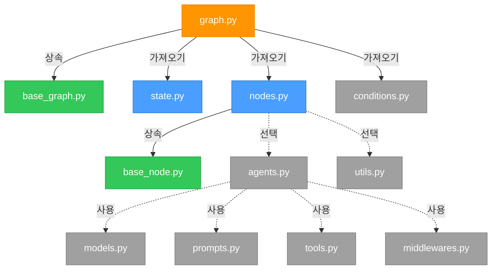
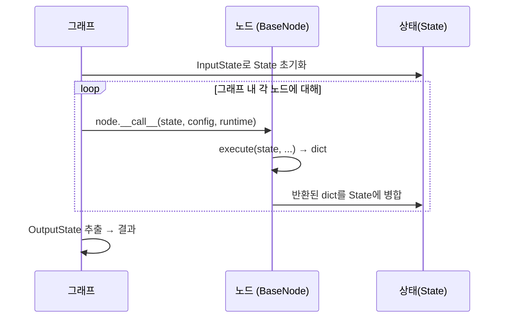
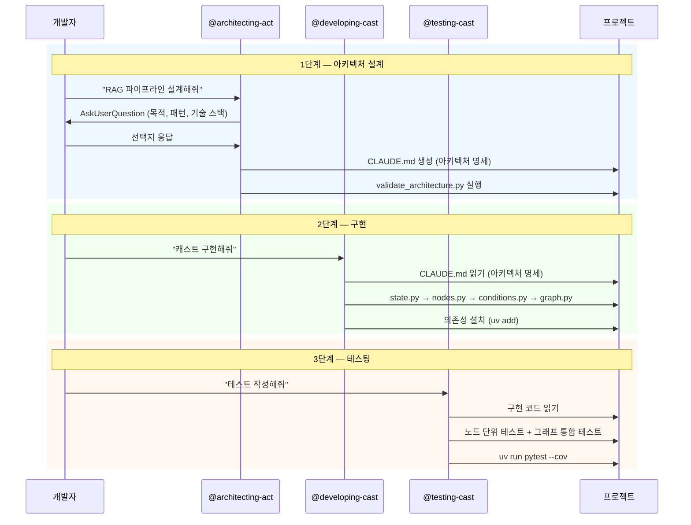

<div align="center">
  <a href="https://www.proact0.org/">
    <picture>
      <source media="(prefers-color-scheme: light)" srcset=".github/images/light-theme.png">
      <source media="(prefers-color-scheme: dark)" srcset=".github/images/dark-theme.png">
      
    </picture>
  </a>
</div>

<div align="center">
  <h2>Act Operator</h2>
</div>

<div align="center">
  <a href="https://www.apache.org/licenses/LICENSE-2.0" target="_blank"></a>
  <a href="https://pypistats.org/packages/act-operator" target="_blank"></a>
  <a href="https://pypi.org/project/act-operator/#history" target="_blank"></a>
  <a href="https://www.linkedin.com/company/proact0" target="_blank">
    
  </a>
  <a href="https://www.proact0.org/" target="_blank">
    
  </a>
</div>

<br>

※ Read this in English: [README.md](README.md)

Act Operator는 AI 협업 기능이 내장된 구조화된 LangGraph 1.0+ 프로젝트(Act)를 스캐폴딩하는 프로덕션 레디 CLI입니다.

```bash
uvx --from act-operator act new
```

아키텍처 설계, 개발, 엔지니어링, 테스팅을 위한 전문화된 Agent 스킬이 포함된 템플릿으로 깔끔하고 모듈화된 그래프 아키텍처를 생성하여, 최적의 유지보수성과 AI 지원 개발로 복잡한 에이전트 워크플로우, 비즈니스 자동화 또는 데이터 파이프라인을 구축할 수 있습니다.

<picture>
  <source media="(prefers-color-scheme: light)" srcset=".github/images/flowchart-light-theme-kr.png">
  <source media="(prefers-color-scheme: dark)" srcset=".github/images/flowchart-dark-theme-kr.png">
  
</picture>

## Act란 무엇인가요?

Act는 프로덕션 수준의 AI 시스템 구축에서 발생하는 일반적인 문제를 해결하도록 설계된 LangGraph 1.0+ 애플리케이션을 위한 표준화된 프로젝트 구조입니다:

- **모듈식 설계**: 각 그래프 컴포넌트(상태, 노드, 에이전트, 도구, 미들웨어 등)는 명확한 책임을 가진 자체 모듈에 존재합니다
- **확장 가능한 아키텍처**: 모노레포 내에서 여러 그래프(캐스트)를 구성하며, 각각 독립적인 패키지로 관리됩니다
- **AI 네이티브 개발**: 내장된 Agent 스킬이 아키텍처 결정, 구현 패턴, 테스팅 전략을 안내합니다
- **초보자 친화적**: 포괄적인 문서와 인라인 가이드로 LangGraph를 처음 접하는 사용자도 쉽게 시작할 수 있습니다

**사용 사례**: 에이전트 AI 시스템, 비즈니스 워크플로우 자동화, 다단계 데이터 파이프라인, 대화형 에이전트, 문서 처리 플로우 또는 **상태 기반 그래프/워크플로우 오케스트레이션이 필요한 모든 애플리케이션**

## 빠른 시작

Python 3.11+ 필요. CLI가 프로젝트 세부 정보를 입력받거나 옵션으로 전달할 수 있습니다.

```bash
# 새로운 Act 프로젝트 생성
uvx --from act-operator act new

# 대화형 프롬프트 따라하기:
# - 경로 : 기본값 [.], 또는 새로운 프로젝트 경로(이 경우 경로가 이름입니다.) 입력
# - Act 이름: project_name
# - Cast 이름: workflow_name
```

### 동기화

프로젝트를 생성한 후, 의존성을 설치하고 가상 환경을 동기화합니다:

```bash
uv sync
```

이 명령은 `pyproject.toml`에 정의된 모든 의존성을 설치하고 프로젝트 실행을 준비합니다.


### AI와 함께 빌드 시작하기

Act에는 **Agent Skills**가 내장되어 있습니다. 이는 AI 에이전트가 프로젝트를 위한 전문 기능을 **발견(Discover), 활성화(Activate), 실행(Execute)** 할 수 있도록 하는 지침 폴더입니다.

**Claude Code**를 사용하는 경우, `.claude/skills`에 사전 구성되어 있습니다.

```bash
claude
```

프롬프트에서 스킬 이름을 언급하기만 하면 됩니다 (예: "@architecting-act를 사용하여 설계해줘...").

> **다른 도구 사용 시 참고**: `.claude` 디렉터리 명명은 Claude Code 전용입니다. Agent Skills를 지원하는 다른 AI 도구(Cursor, Gemini CLI 등)를 사용하는 경우, 해당 도구의 요구사항에 맞춰 디렉터리 이름을 변경하거나 설정하세요.

**사용 가능한 스킬**:
- `architecting-act`: 대화형 질문을 통한 그래프 아키텍처 설계,  CLAUDE.md 생성
- `developing-cast`: 모범 사례 패턴으로 노드, 에이전트, 도구 구현
- `testing-cast`: 모킹 전략을 활용한 효과적인 pytest 테스트 작성

### 스킬 활용하기

**CLAUDE.md에 대해**: 스킬은 분산 구조로 `CLAUDE.md` 파일을 생성하고 참조합니다:
- **루트 `/CLAUDE.md`**: Act 개요, 목적, 모든 Cast 테이블
- **Cast `/casts/{cast_slug}/CLAUDE.md`**: 상세한 Cast 명세 (아키텍처 다이어그램, 상태 스키마, 노드, 의존성)

스킬은 개별적으로 또는 워크플로우 형태로 사용할 수 있습니다:

**개별 사용**:
- **초기 프로젝트 아키텍처** → `architecting-act` 사용 (모드 1: 초기 설계)
  - `act new` 실행 후, 대화형 질문을 통해 첫 번째 Act와 Cast 설계
  - 아키텍처 다이어그램과 함께 루트 및 캐스트별 CLAUDE.md 파일 생성

- **새 Cast 추가** → `architecting-act` 사용 (모드 2: Cast 추가)
  - 기존 CLAUDE.md 파일을 읽어 컨텍스트 파악
  - 새 캐스트 설계 및 CLAUDE.md 파일 업데이트
  - 생성된 CLAUDE.md에 개발 명령어 포함 (캐스트 생성, 의존성 관리)

- **복잡한 Cast 추출** → `architecting-act` 사용 (모드 3: Sub-Cast 추출)
  - 10개 이상의 노드를 가진 캐스트의 복잡도 분석
  - 재사용 가능한 로직을 서브 캐스트로 추출
  - 서브 캐스트 관계와 함께 CLAUDE.md 업데이트

- **구현** → `developing-cast` 사용
  - 캐스트의 CLAUDE.md에서 명세 읽기
  - state → deps → nodes → conditions → graph 순서로 구현
  - 50개 이상의 패턴 활용 (agents, tools, memory, middlewares)

- **테스팅** → `testing-cast` 사용
  - 모킹 전략을 활용한 pytest 테스트 작성
  - 노드 레벨 및 그래프 레벨 테스트 커버

**워크플로우 예시**:

*예시 1: 새 프로젝트 시작*
```plaintext
1. 프로젝트 생성 → 실행: uvx --from act-operator act new

2. 아키텍처 설계 → "고객 지원 챗봇 설계"
   (architecting-act 모드 1: 질문하고, Sequential 패턴 제안, /CLAUDE.md + /casts/chatbot/CLAUDE.md 생성)

3. 구현 → "CLAUDE.md 기반으로 챗봇 구현"
   (developing-cast: /casts/chatbot/CLAUDE.md 읽고, state/nodes/graph 구현)

4. 테스트 → "포괄적인 테스트 작성"
   (testing-cast: LLM 모킹을 포함한 pytest 생성)
```

*예시 2: 기존 프로젝트에 추가*
```plaintext
1. 새 Cast 설계 → "문서 인덱싱을 위한 knowledge-base 캐스트 추가"
   (architecting-act 모드 2: /CLAUDE.md 읽고, 새 캐스트 설계, CLAUDE.md 파일 업데이트)

2. Cast 스캐폴딩 → "knowledge-base 캐스트 패키지 생성"
   (CLAUDE.md 개발 명령어에 따라 `uv run act cast -c "knowledge-base"` 실행)

3. 구현 → "CLAUDE.md 기반으로 knowledge-base 구현"
   (developing-cast: /casts/knowledge-base/CLAUDE.md 읽고, 컴포넌트 구현)
```

*예시 3: 복잡한 Cast 리팩토링*
```plaintext
1. 복잡도 분석 → "챗봇 캐스트가 12개의 노드를 가지고 있어 복잡하게 느껴집니다"
   (architecting-act 모드 3: /casts/chatbot/CLAUDE.md 분석, 재사용 가능한 검증 로직 식별)

2. Sub-Cast 추출 → "입력 검증을 별도 캐스트로 추출"
   (architecting-act: /casts/input-validator/CLAUDE.md 생성, 부모 참조 업데이트)

3. Sub-Cast 구현 → "input-validator 구현"
   (developing-cast: 서브 캐스트 구현, CLAUDE.md 명령어로 의존성 관리)
```

## 아키텍처

### 모듈 의존성

아래 다이어그램은 Cast 내부 모듈 간의 연결 구조를 보여줍니다.



> **범례**: 🟠 진입점 / 🔵 필수 / 🟢 베이스 클래스 / ⚫ 선택적

### 실행 흐름



### 노드 시그니처

노드는 `BaseNode`을 상속하고 필요한 파라미터만 선언합니다:

| 시그니처 | 접근 가능 항목 |
|---------|-------------|
| `execute(self, state)` | State만 |
| `execute(self, state, config)` | + thread_id, tags |
| `execute(self, state, runtime)` | + store, stream |
| `execute(self, state, config, runtime)` | 전체 접근 |

### 스킬 기반 개발 흐름



## 프로젝트 구조

```
my_workflow/
├── .claude/
│   └── skills/                    # AI 협업 가이드
│       ├── architecting-act/      # 아키텍처 설계 및 개발 명령어
│       │   ├── resources/         # 디자인 패턴, 질문, 결정 매트릭스
│       │   ├── scripts/           # 아키텍처 검증 (validate_architecture.py)
│       │   └── templates/         # CLAUDE.md 생성 템플릿
│       ├── developing-cast/       # 구현 패턴
│       │   └── resources/         # 50개 이상의 LangGraph 패턴 (core, agents, memory, middleware, ...)
│       └── testing-cast/          # 테스팅 전략
│           └── resources/         # 모킹, 픽스처, 커버리지 가이드
├── casts/
│   ├── base_node.py              # 베이스 노드 클래스 (동기/비동기, 시그니처 검증)
│   ├── base_graph.py             # 베이스 그래프 클래스 (추상 build 메서드)
│   └── chatbot/                  # 캐스트 (그래프 패키지)
│       ├── modules/
│       │   ├── state.py          # [필수] InputState, OutputState, State
│       │   ├── nodes.py          # [필수] 노드 구현 (BaseNode 서브클래스)
│       │   ├── agents.py         # [선택] 에이전트 설정
│       │   ├── tools.py          # [선택] 도구 정의 / MCP 어댑터
│       │   ├── models.py         # [선택] LLM 모델 설정
│       │   ├── conditions.py     # [선택] 라우팅 조건
│       │   ├── middlewares.py    # [선택] 라이프사이클 훅 (before/after agent/model)
│       │   ├── prompts.py        # [선택] 프롬프트 템플릿
│       │   └── utils.py          # [선택] 헬퍼 함수
│       ├── graph.py              # 그래프 조립 (BaseGraph 서브클래스 → 진입점)
│       └── pyproject.toml        # 캐스트별 의존성
├── tests/
│   ├── cast_tests/               # 그래프 통합 테스트
│   └── node_tests/               # 노드 단위 테스트
├── langgraph.json                # LangGraph 진입점 (그래프 등록)
├── pyproject.toml                # 모노레포 워크스페이스 (uv workspace, 공유 의존성)
├── TEMPLATE_README.md            # 템플릿 사용 가이드라인
└── README.md
```

## 사용법

### 새로운 캐스트 생성

기존 Act 프로젝트에 다른 그래프 추가하기:

```bash
uv run act cast
# 캐스트 이름과 설정에 대한 대화형 프롬프트
```

### 의존성 추가

```bash
# 모노레포 레벨 (모든 캐스트에서 공유)
uv add langchain-openai

# 캐스트별
uv add --package chatbot langchain-anthropic

# 개발 도구
uv add --dev pytest-mock
```

### 개발 서버 실행

```bash
uv run langgraph dev
```

LangGraph Studio가 `http://localhost:8000`에서 열리며 시각적 그래프 디버깅이 가능합니다.

## 주요 기능

### 1. 구조화된 모듈성

각 모듈은 명확한 가이드라인과 함께 단일 책임을 가집니다:

- **state.py**: 그래프 상태를 위한 TypedDict 스키마 정의
- **nodes.py**: 노드 클래스로 비즈니스 로직 구현
- **agents.py**: 도구와 메모리를 포함한 LLM 에이전트 설정
- **tools.py**: 재사용 가능한 도구 함수 생성
- **conditions.py**: 노드 간 라우팅 로직 정의
- **graph.py**: 컴포넌트를 실행 가능한 그래프로 조립

### 2. AI 지원 개발

내장된 Claude Code 스킬이 워크플로우를 최적화합니다:

- **토큰 효율적**: 불필요한 코드 생성 없이 컨텍스트 인식 가이드 제공
- **대화형**: 아키텍처 스킬은 "20개 질문" 방식으로 요구사항 파악
- **포괄적**: 노드, 에이전트, 도구, 미들웨어, 테스팅을 위한 50개 이상의 구현 패턴
- **공식 문서**: 모든 패턴이 공식 LangChain 1.0+/LangGraph 1.0+ 문서 참조

### 3. 프로덕션 레디 패턴

실전 검증된 패턴 포함:

- **메모리 관리**: 단기(대화 기록) 및 장기(Store API)
- **안정성**: 재시도 로직, 폴백, 오류 처리
- **안전성**: 가드레일, 속도 제한, 인간 승인 단계
- **관찰성**: LangSmith 통합, 구조화된 로깅
- **테스팅**: 모킹 전략, 픽스처, 커버리지 가이드라인

### 4. 초보자 친화적

LangChain 1.0+/LangGraph 1.0+ 입문자에게 완벽합니다:

- 단계별 구현 가이드
- 패턴 결정 매트릭스
- 유용한 프롬프트를 제공하는 대화형 CLI
- 포괄적인 인라인 문서
- 일반적인 사용 사례를 위한 예제 패턴

## CLI 명령어

```bash
# 새로운 Act 프로젝트 생성
act new [OPTIONS]
  --act-name TEXT       프로젝트 이름
  --cast-name TEXT      초기 캐스트 이름
  --path PATH           대상 디렉토리

# 기존 프로젝트에 캐스트 추가
act cast [OPTIONS]
  --cast-name TEXT      캐스트 이름
  --path PATH           Act 프로젝트 디렉토리
```

## 기여하기

커뮤니티의 기여를 환영합니다! 기여 가이드를 읽어주세요:

- [CONTRIBUTING_KR.md](CONTRIBUTING_KR.md) (한국어)

### 기여자

모든 기여자분들께 감사드립니다! 여러분의 기여가 Act Operator를 더 나아지게 만듭니다.

<a href="https://github.com/Proact0/act-operator/graphs/contributors">
  
</a>

## 라이선스

Apache License 2.0 - 자세한 내용은 [LICENSE](https://www.apache.org/licenses/LICENSE-2.0) 참조.

---

<div align="center">
  <p><a href="https://www.proact0.org/">Proact0</a>가 ❤️로 만들었습니다</p>
  <p>Act (AX Template) 표준화 및 AI 생산성 향상을 위한 비영리 오픈소스 허브</p>
</div>
